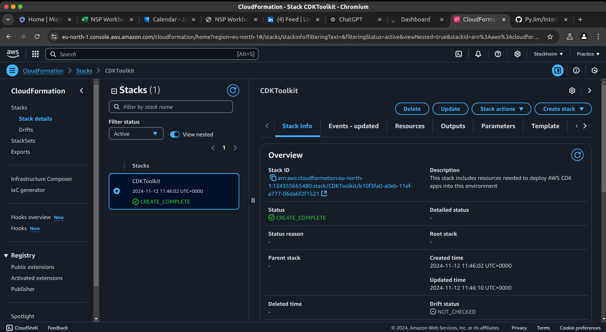
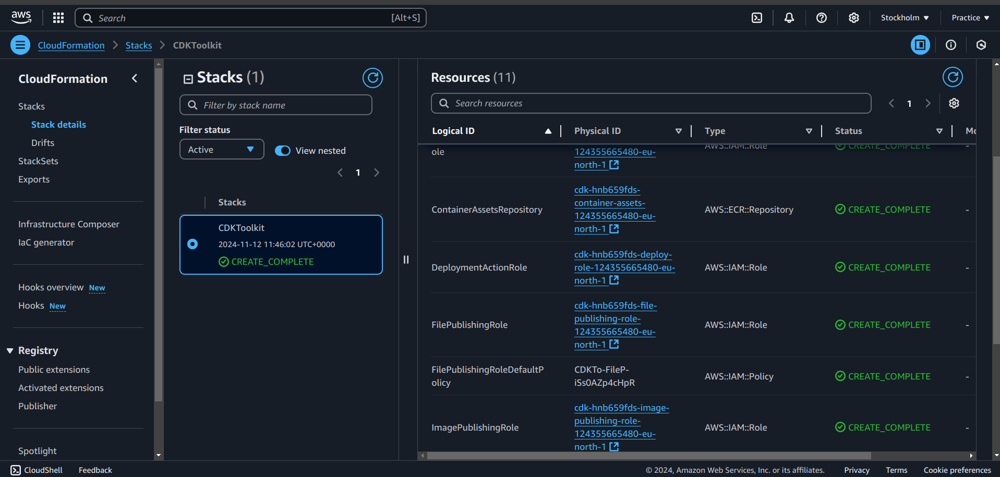
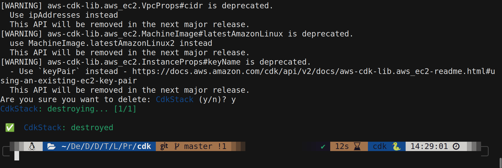

# Welcome to Your CDK Python Project!

This project demonstrates how to develop AWS infrastructure using the AWS Cloud Development Kit (CDK) with Python.

The `cdk.json` file tells the CDK Toolkit how to execute your app.

This project is set up like a standard Python project. The initialization process also creates a virtual environment (`virtualenv`) within this project, stored under the `.venv` directory. Follow the steps below to set up and run the project.

---

## Project Setup

### Create the Virtual Environment
To manually create a virtual environment on macOS and Linux:

```bash
python3 -m venv .venv
```

On Windows:

```cmd
python -m venv .venv
```

### Activate the Virtual Environment
- On macOS/Linux:
  ```bash
  source .venv/bin/activate
  ```
- On Windows:
  ```cmd
  .venv\Scripts\activate.bat
  ```

### Install Dependencies
Once the virtual environment is activated, install the required dependencies:

```bash
pip install -r requirements.txt
```

### Synthesize the CloudFormation Template
To generate the CloudFormation template for this project, run:

```bash
cdk synth
```

---

## Workflow Commands

Here are some useful CDK commands for managing your project:

- **`cdk ls`**: List all stacks in the app.
- **`cdk synth`**: Emit the synthesized CloudFormation template.
- **`cdk deploy`**: Deploy this stack to your default AWS account/region.
- **`cdk diff`**: Compare the deployed stack with the current state.
- **`cdk destroy`**: Destroy the deployed stack.
- **`cdk docs`**: Open the CDK documentation.

---

## Evidence of Completed Lab

### 1. Bootstrap the Environment
The image below shows the successful execution of the `cdk bootstrap` command, which sets up the necessary resources for deploying CDK apps:



### 2. Synthesized CloudFormation Template
The image below shows the result of the `cdk synth` command, which generates the CloudFormation template for the stack:



### 3. Destroy the Stack
The image below confirms the successful execution of the `cdk destroy` command, which removes the deployed resources:



---

## Notes

- To add additional dependencies (e.g., other CDK libraries), modify the `setup.py` file and re-run `pip install -r requirements.txt`.
- The `cdk.json` file is pre-configured for running this project. You can adjust it as needed.
